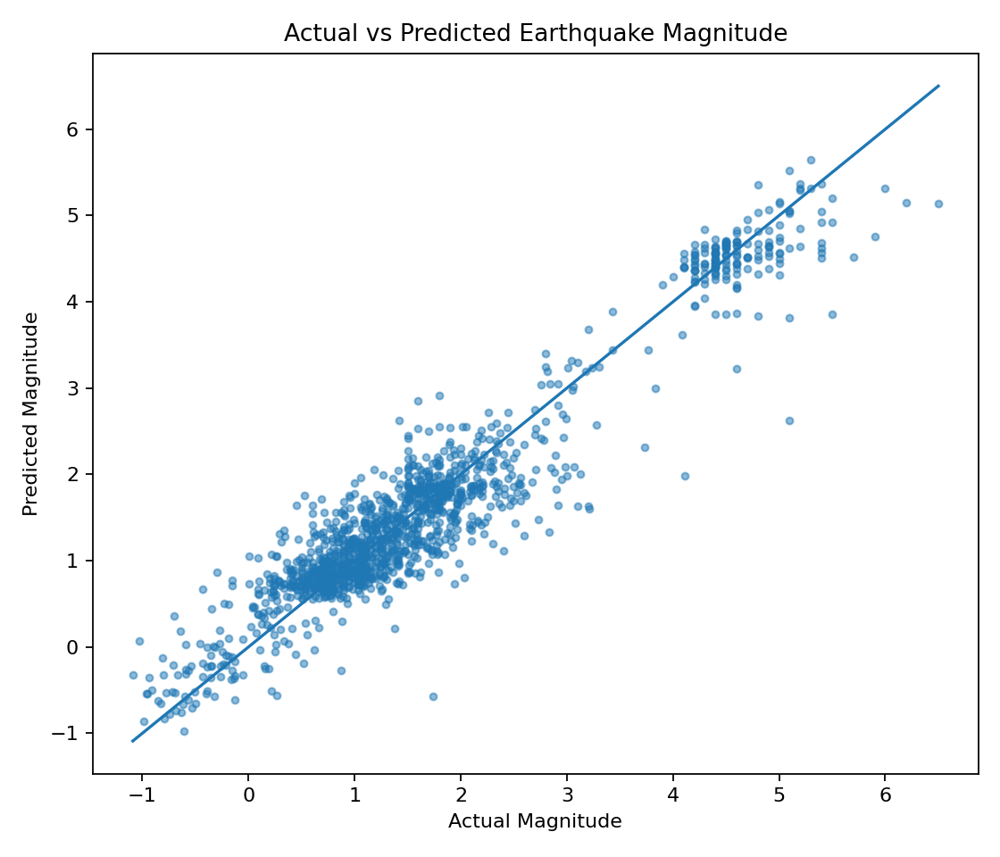
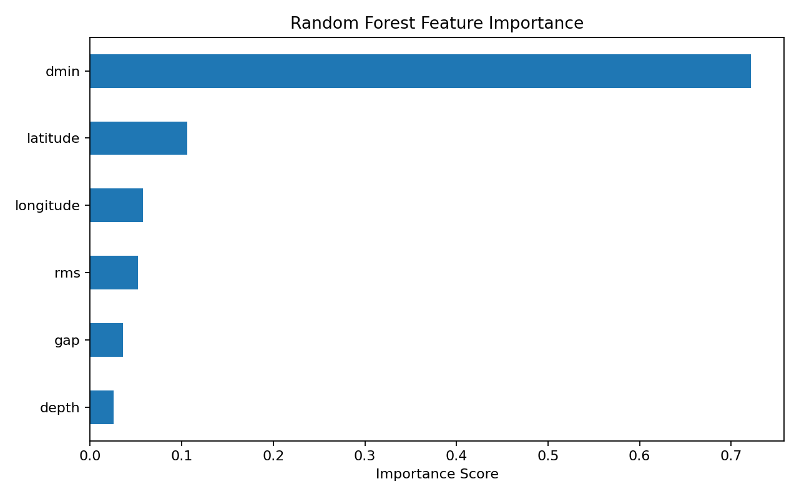
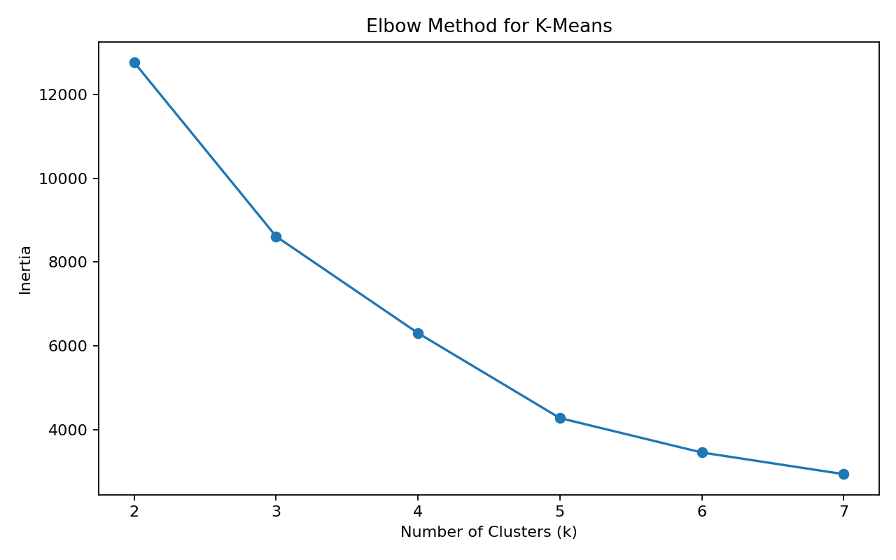
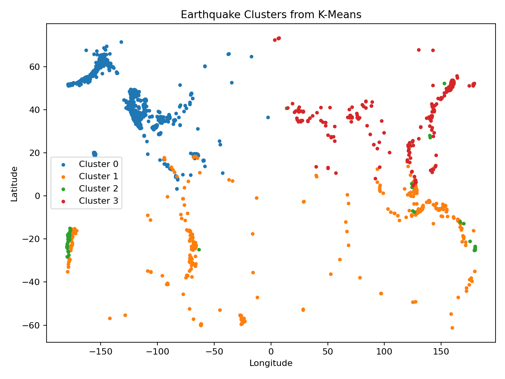
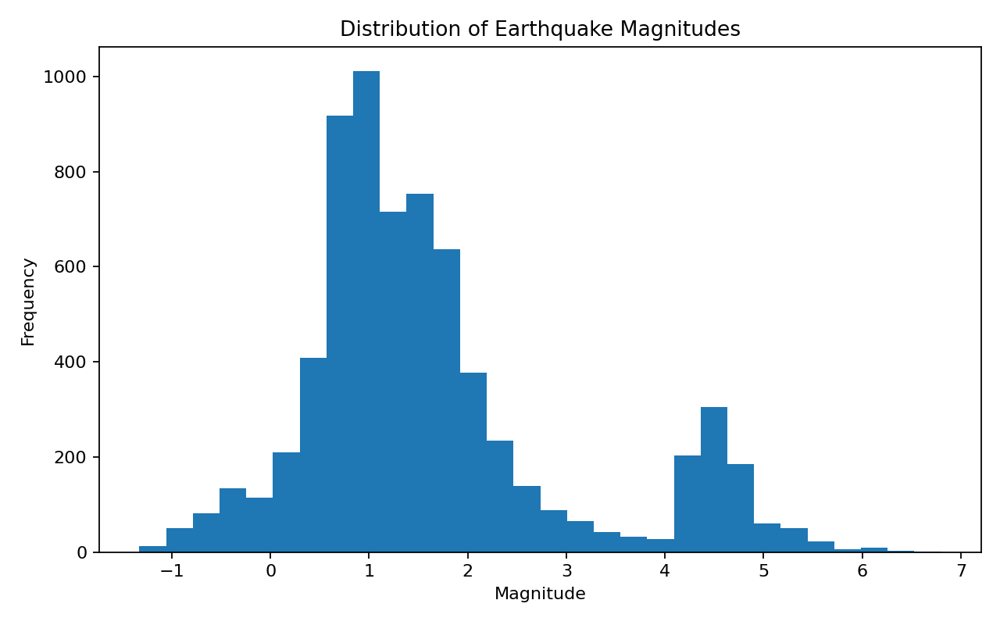
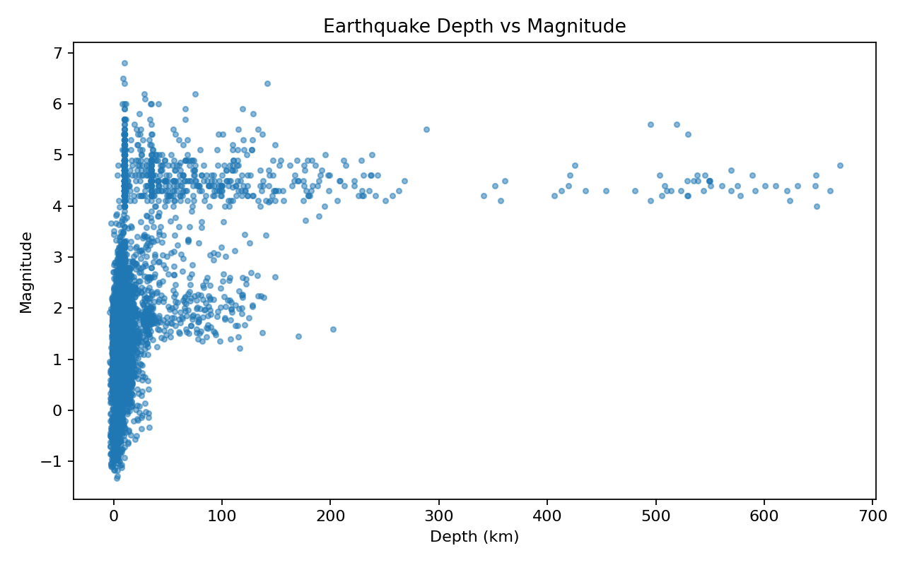
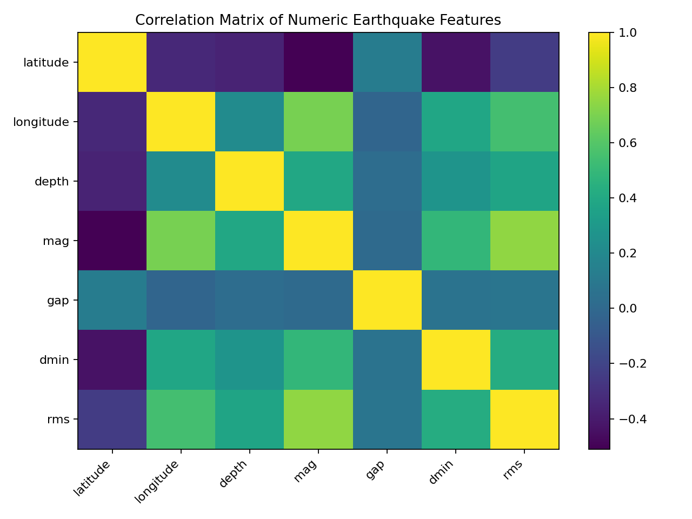

# Earthquake Machine Learning Analysis

A machine-learning project using a **USGS earthquake dataset** to demonstrate data preprocessing, **Random Forest regression**, feature interpretation, model evaluation, and **K-Means clustering**.

## Portfolio Context

This repository contains **Tanay Deepak Kadam's documented earthquake-analysis contribution** from a wider MSc Data Mining and Machine Learning group project.

The original group submission also included UK petition NLP and NYC taxi modelling completed by other team members. Those sections are intentionally excluded here so this repository represents only my own documented technical contribution.

## Tech Stack

- Python
- Pandas
- NumPy
- Scikit-learn
- Matplotlib
- Jupyter Notebook
- Random Forest Regression
- K-Means Clustering

## Dataset

- Source: USGS Earthquake Hazards Program
- Snapshot records: **7,875**
- Raw columns: **22**
- Clean modelling records: **6,900**
- Data type: numeric + geospatial
- Usage: Public Domain

## Random Forest Regression

The model estimates earthquake magnitude from:

- latitude
- longitude
- depth
- gap
- dmin
- rms

### Model Performance

| Metric | Result |
|---|---:|
| R² | **0.905** |
| RMSE | **0.417** |
| MAE | **0.306** |



## Feature Importance



In the reproduced model, **`dmin`** has the highest feature-importance score.

This is a predictive-model result only and should not be interpreted as evidence of physical causation.

## K-Means Clustering

K-Means was applied to standardized **latitude, longitude and depth** features.

The original project retained **k = 4** after inspecting the elbow curve.





The clusters are exploratory spatial/depth groupings and are not presented as validated geological fault lines.

## Exploratory Analysis

### Magnitude Distribution


### Depth vs Magnitude


### Correlation Matrix


## Repository Structure

```text
earthquake-machine-learning-analysis/
├── data/
│   ├── README.md
│   └── usgs_all_month_2025-11-24.csv
├── images/
│   ├── actual_vs_predicted.png
│   ├── correlation_matrix.png
│   ├── depth_vs_magnitude.png
│   ├── earthquake_clusters.png
│   ├── feature_importance.png
│   ├── kmeans_elbow.png
│   └── magnitude_distribution.png
├── notebooks/
│   └── earthquake_ml_analysis.ipynb
├── results/
│   ├── feature_importance.csv
│   └── regression_metrics.csv
├── .gitignore
├── README.md
└── requirements.txt
```

## How to Run

```bash
pip install -r requirements.txt
```

Then open:

```text
notebooks/earthquake_ml_analysis.ipynb
```

and run the notebook from top to bottom.

## Author

**Tanay Deepak Kadam**  
MSc Data Analytics — Dublin, Ireland  
[LinkedIn](https://www.linkedin.com/in/tanay-deepak-kadam)

### Original Academic Group

The wider academic submission was completed with **Bhavesh Pradipkumar Bhonde** and **Grace Sameer Gaikwad**. This public repository contains only Tanay's documented earthquake-analysis contribution.
